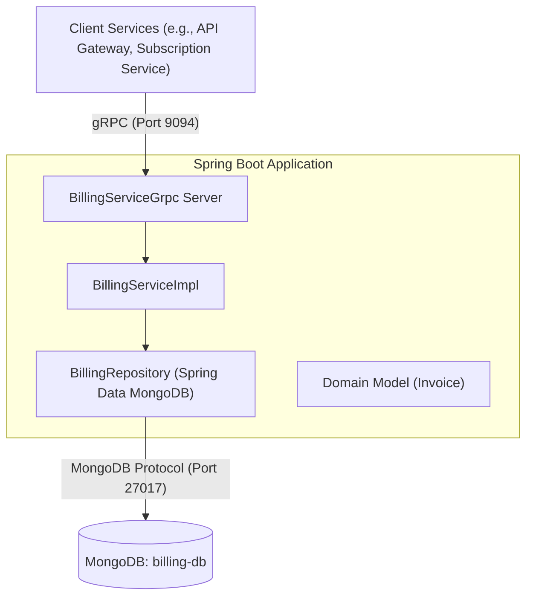
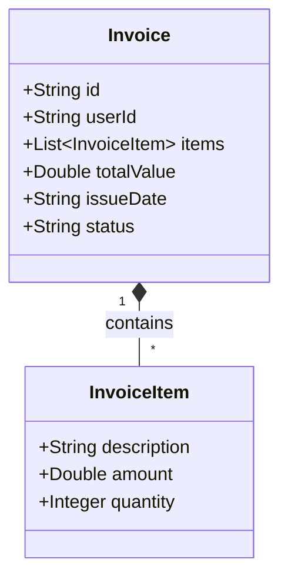
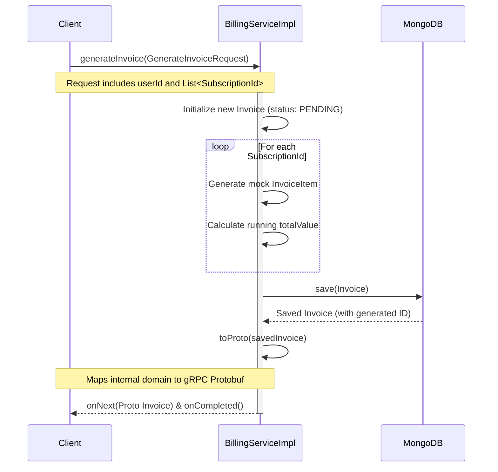
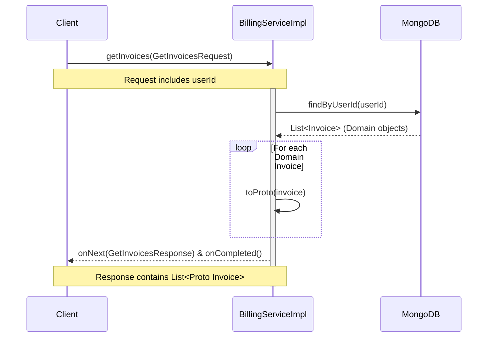

# Billing Service Documentation

## 1. Overview
The **Billing Service** is a Spring Boot-based microservice responsible for generating and managing user invoices. It leverages **MongoDB** for persistent storage and exposes its operations via **gRPC** to ensure high-performance, strongly typed communication with other microservices in the ecosystem.

## 2. System Architecture

The service follows a standard layered architecture pattern integrated with gRPC:

### Core Components:
- **`BillingServiceImpl`**: The core `@GrpcService` class that processes incoming requests.
- **`BillingRepository`**: Interface extending `MongoRepository` that handles database operations.
- **`proto-common`**: External shared module where the Protobuf descriptors (`BillingServiceGrpc`, `Invoice`, etc.) are defined.

## 3. Domain Model

The service domain consists of a main `Invoice` document that embeds multiple `InvoiceItem` sub-documents.

- **`status`**: Can be `PENDING` or `PAID`.
- **`items`**: Represents individual line items for the services or subscriptions being billed.

## 4. gRPC Workflows

The service exposes the following main entry points. Below are the sequence diagrams illustrating their behavior.

### 4.1. Generating an Invoice (`generateInvoice`)
When an upstream service requests an invoice generation, the Billing Service currently creates mock invoice items based on the provided subscription IDs and persists the new invoice.

### 4.2. Retrieving User Invoices (`getInvoices`)
Allows retrieving the full history of invoices for a given user.

## 5. Technology Stack Summary
- **Framework:** Spring Boot (`spring-boot-starter-web`)
- **Database:** MongoDB (`spring-boot-starter-data-mongodb`)
- **RPC Protocol:** gRPC (`grpc-spring-boot-starter`)
- **Testing:** Karate (`karate-junit5`), Spring Boot Test
- **Build Tool:** Gradle
