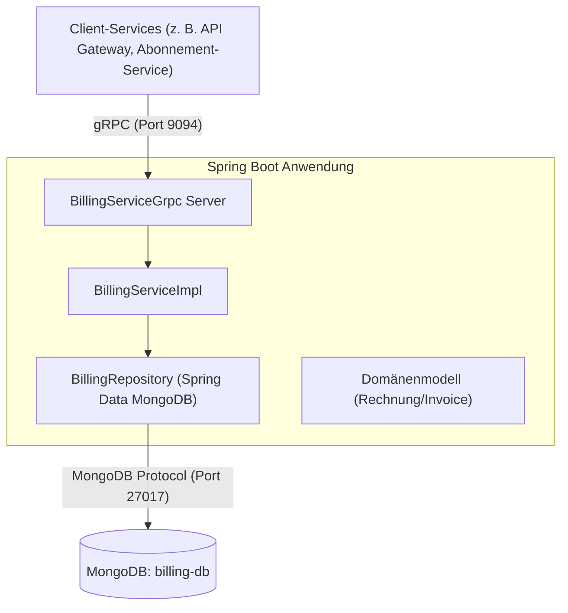
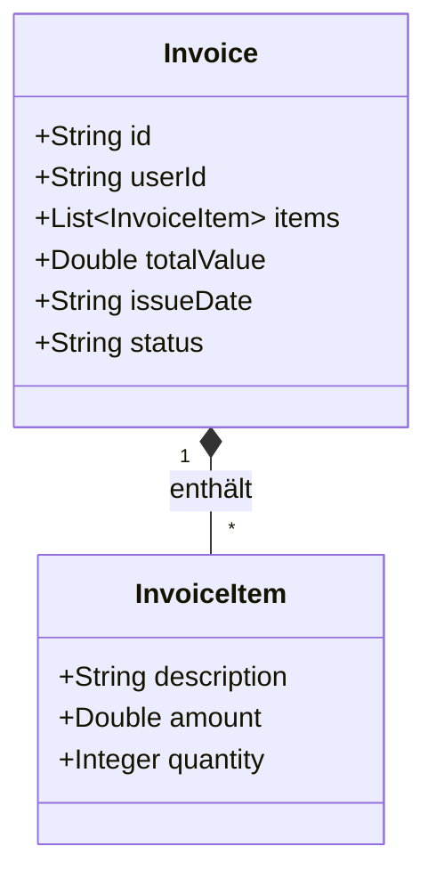
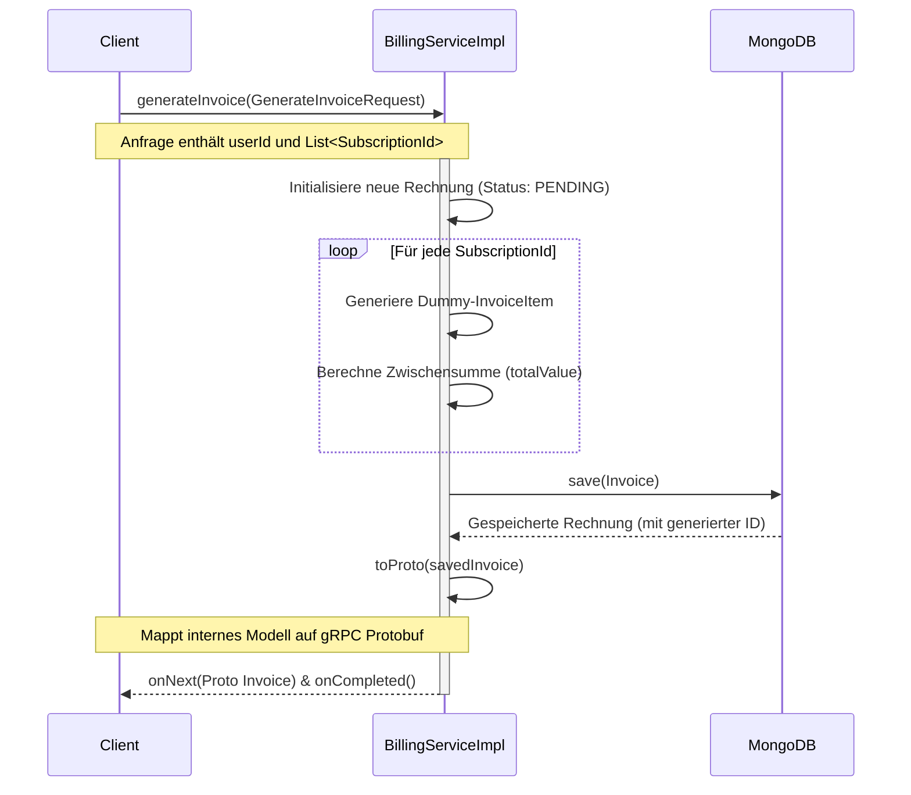
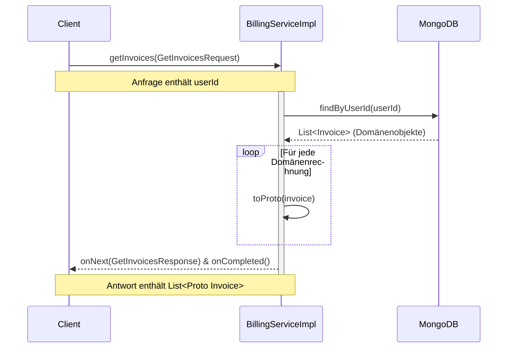

# Abrechnungsservice-Dokumentation

## 1. Überblick
Der **Abrechnungsservice (Billing Service)** ist ein Spring-Boot-basierter Microservice, der für die Generierung und Verwaltung von Benutzerrechnungen zuständig ist. Er nutzt **MongoDB** zur dauerhaften Speicherung und stellt seine Operationen über **gRPC** bereit, um eine hochleistungsfähige, stark typisierte Kommunikation mit anderen Microservices im Ökosystem sicherzustellen.

## 2. Systemarchitektur

Der Service folgt einem typischen Schichtenarchitektur-Muster, das mit gRPC integriert ist:

### Hauptkomponenten:
- **`BillingServiceImpl`**: Die zentrale `@GrpcService`-Klasse, die eingehende Anfragen verarbeitet.
- **`BillingRepository`**: Schnittstelle, die `MongoRepository` erweitert und Datenbankoperationen abwickelt.
- **`proto-common`**: Externes gemeinsames Modul, in dem die Protobuf-Deskriptoren (`BillingServiceGrpc`, `Invoice` usw.) definiert sind.

## 3. Domänenmodell

Die Servicedomäne besteht aus einem Hauptdokument `Invoice` (Rechnung), in das mehrere Sub-Dokumente vom Typ `InvoiceItem` (Rechnungsposten) eingebettet sind.

- **`status`**: Kann `PENDING` (Ausstehend) oder `PAID` (Bezahlt) sein.
- **`items`**: Stellt individuelle Rechnungsposten für die in Rechnung gestellten Dienste dar.

## 4. gRPC-Workflows

Der Service stellt die folgenden Haupteinstiegspunkte bereit. Nachfolgend finden Sie Sequenzdiagramme, die ihr Verhalten veranschaulichen.

### 4.1. Generieren einer Rechnung (`generateInvoice`)
Wenn ein aufrufender Service die Rechnungsgenerierung anfordert, erstellt der Abrechnungsservice derzeit Dummy-Rechnungsposten basierend auf den bereitgestellten Abonnement-IDs und speichert die neue Rechnung ab.

### 4.2. Abrufen von Benutzerrechnungen (`getInvoices`)
Ermöglicht das Abrufen des kompletten Rechnungsverlaufs für einen bestimmten Benutzer.

## 5. Zusammenfassung des Technologie-Stacks
- **Framework:** Spring Boot (`spring-boot-starter-web`)
- **Datenbank:** MongoDB (`spring-boot-starter-data-mongodb`)
- **RPC Protokoll:** gRPC (`grpc-spring-boot-starter`)
- **Tests:** Karate (`karate-junit5`), Spring Boot Test
- **Build-Tool:** Gradle
