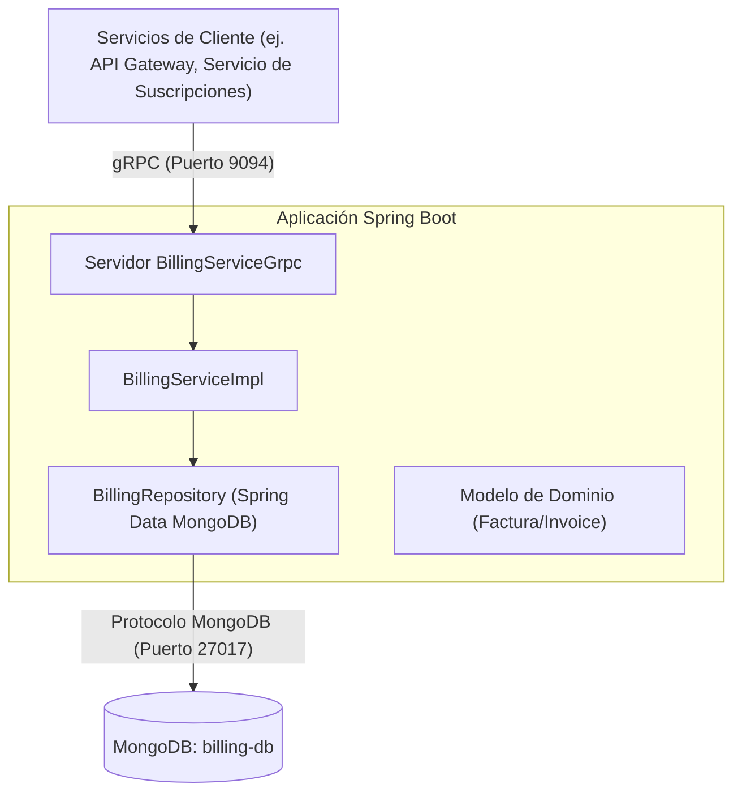
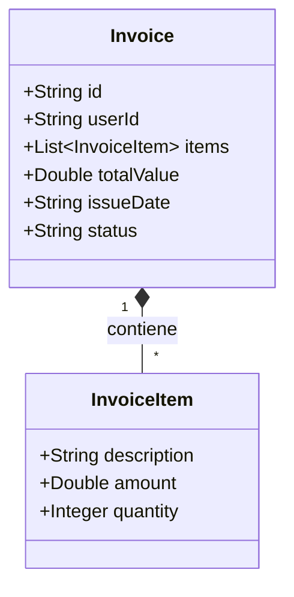
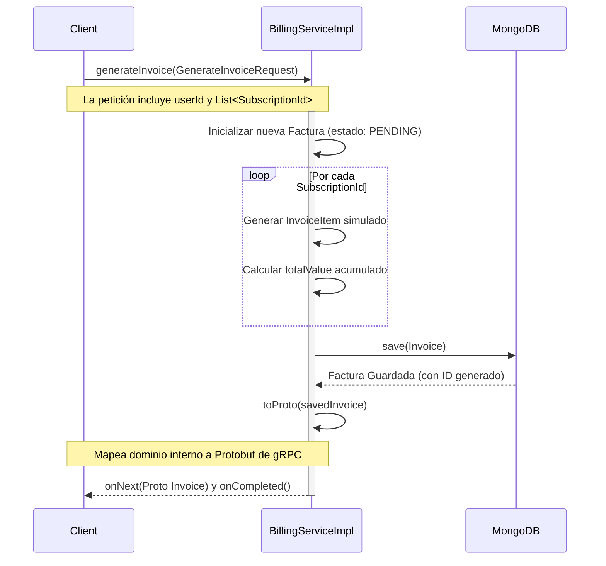
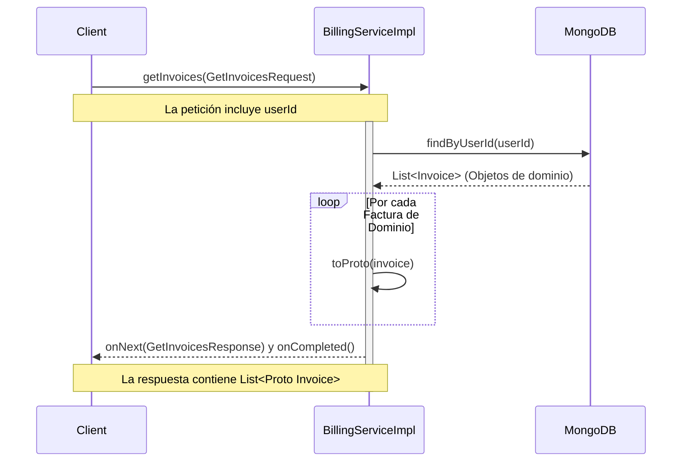

# Documentación del Servicio de Facturación

## 1. Descripción General
El **Servicio de Facturación (Billing Service)** es un microservicio basado en Spring Boot responsable de generar y gestionar las facturas de los usuarios. Utiliza **MongoDB** para el almacenamiento persistente y expone sus operaciones a través de **gRPC** para asegurar una comunicación de alto rendimiento y tipado fuerte con otros microservicios en el ecosistema.

## 2. Arquitectura del Sistema

El servicio sigue un patrón de arquitectura en capas estándar integrado con gRPC:

### Componentes Principales:
- **`BillingServiceImpl`**: La clase principal `@GrpcService` que procesa las solicitudes entrantes.
- **`BillingRepository`**: Interfaz que extiende `MongoRepository` y maneja las operaciones de base de datos.
- **`proto-common`**: Módulo compartido externo donde se definen los descriptores de Protobuf (`BillingServiceGrpc`, `Invoice`, etc.).

## 3. Modelo de Dominio

El dominio del servicio consiste en un documento principal `Invoice` (Factura) que incrusta múltiples sub-documentos `InvoiceItem` (Ítem de Factura).

- **`status`**: Puede ser `PENDING` (Pendiente) o `PAID` (Pagada).
- **`items`**: Representa los conceptos individuales que se están facturando.

## 4. Flujos de Trabajo gRPC

El servicio expone los siguientes puntos de entrada principales. A continuación, los diagramas de secuencia que ilustran su comportamiento.

### 4.1. Generar una Factura (`generateInvoice`)
Cuando un servicio solicitante pide la generación de una factura, el Servicio de Facturación actualmente crea ítems de factura simulados (mock) basados en los IDs de suscripción proporcionados y persiste la nueva factura.

### 4.2. Recuperar Facturas de Usuario (`getInvoices`)
Permite recuperar el historial completo de facturas para un usuario determinado.

## 5. Resumen del Stack Tecnológico
- **Framework:** Spring Boot (`spring-boot-starter-web`)
- **Base de Datos:** MongoDB (`spring-boot-starter-data-mongodb`)
- **Protocolo RPC:** gRPC (`grpc-spring-boot-starter`)
- **Pruebas:** Karate (`karate-junit5`), Spring Boot Test
- **Herramienta de Construcción:** Gradle
