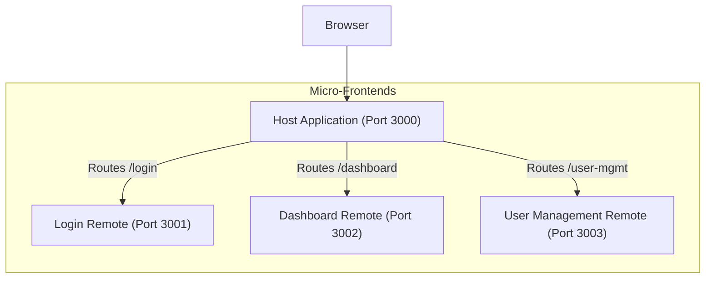
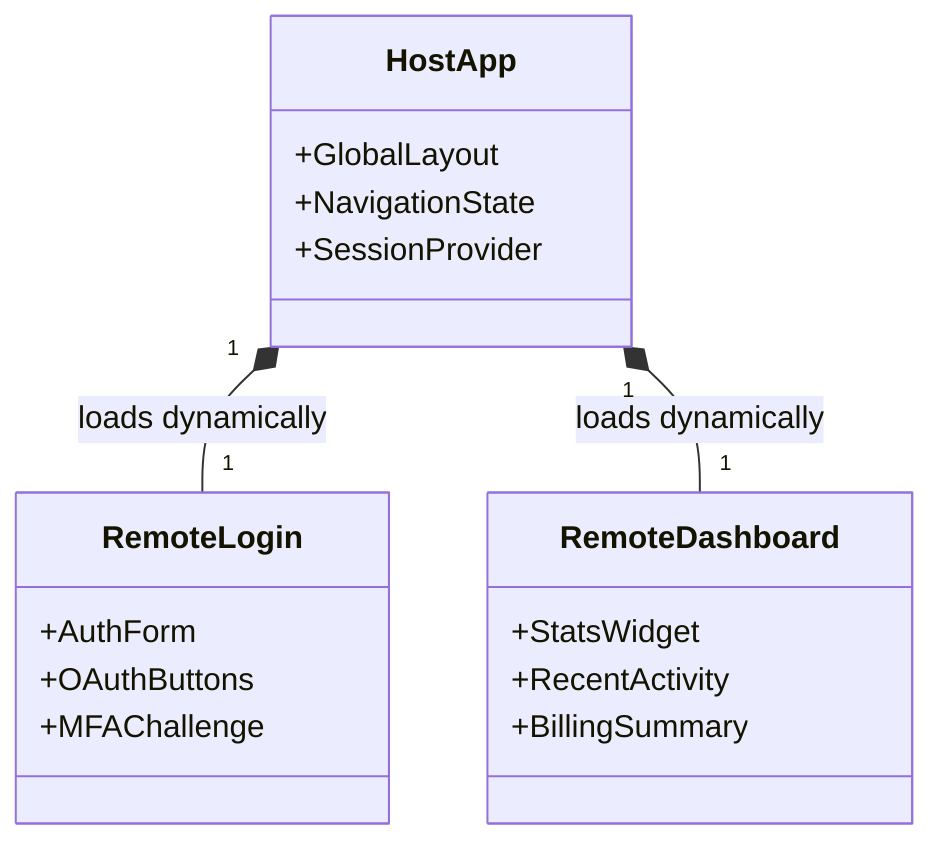
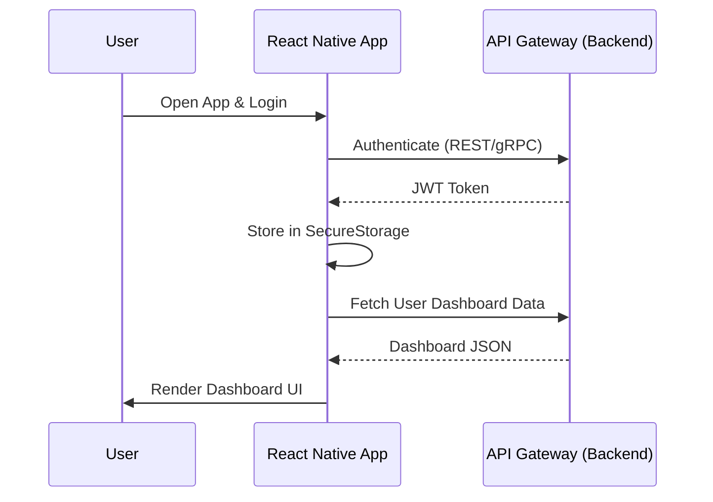

# NBT Platform Frontend Architecture

## 1. Overview
The frontend of the NBT Platform is divided into two major clients:
- **Web**: A modular **Micro-Frontend** architecture built with **Next.js**.
- **Mobile**: A cross-platform mobile application built with **React Native**.

## 2. Web Micro-Frontend Architecture (Module Federation)
The web application is split into multiple independent Next.js applications that are integrated together securely at runtime. This allows autonomous teams to develop, test, and deploy features independently.

### Components:
- **`host`**: The main shell application. It manages global state, routing, and loading remote modules.
- **`login`**: Handles user authentication, credential validation (JWT and 2FA), and session management.
- **`dashboard`**: Displays the main user overview, statistics, and billing summaries.
- **`user-mgmt`**: Handles user profile properties, subscription settings, and account maintenance.

## 3. Component Hierarchy (Web Setup)

## 4. Mobile Application Architecture
The mobile application (located in `frontend/mobile`) targets both iOS and Android platforms via React Native. 

### Mobile Features:
- Native-like performance and UI components.
- Secure storage for JWT authentication tokens.
- Shared backend gRPC/API Gateway consumption identical to the Web application.
